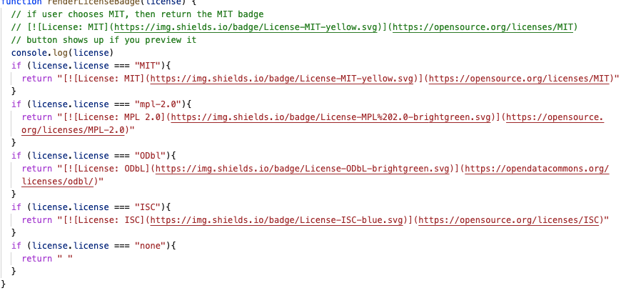
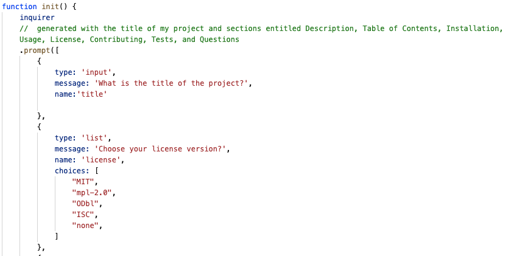
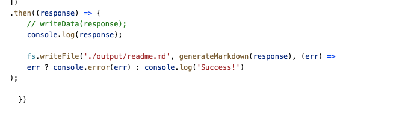
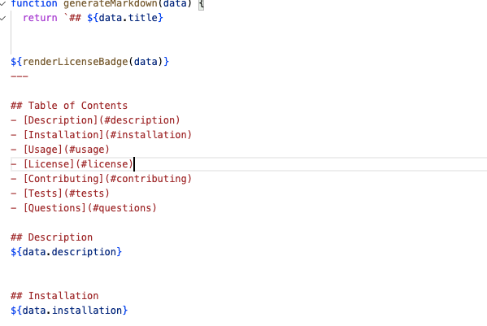

# ReadME Generator
I have created a read me generator with node and npm inquirer. 

## Getting Started

* create a repo
* install npm inquirer
* git ignore the node package 
* write js code
* test by commanding "node index.js

### Steps
* Initialize the init fucntion with inquirer prompts in it
* for license prompt add choices 
* in generate markdown js - make if statement to generate the badge 
* call upon the file with require 
* generate an output file with write file
* call the init function 
* in the markdown function - call on the all the data

### Walkthrough Video
* [See Walkthrough Video] (#)https://drive.google.com/file/d/1-8xNJ0iHbjBh_X3qL7CNqV7DoQh275wD/view

## Built With

* [Javascript] (script.js)
* [Javascript] (generateMarkdown.js)

## Deployed Link

* [See Live Site] (#)https://github.com/umeramalek/readme-generator

## Authors

* **UMERA MALEK** 

- [Link to Portfolio Site](https://umeramalek.github.io/)
- [Link to Github](https://github.com/umeramalek)
- [Link to LinkedIn](www.linkedin.com/in/umeramalek)

